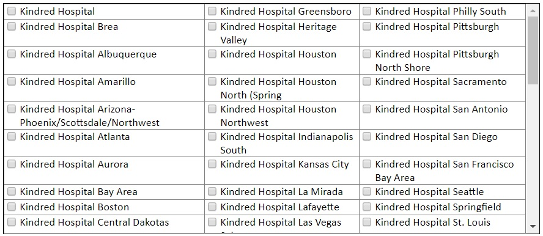

# ThreeColumnChecklist

This is a proof-of-concept I did many years ago when one of our products was written in classic ASP.NET. The request was to get a list of hospitals from the database and render a three-column list of checkboxes where the checkbox itself was an ASP.Net Custom Control. The width and height of the rendered area was clearly defined.  This wasn't meant to be a responsive design.

